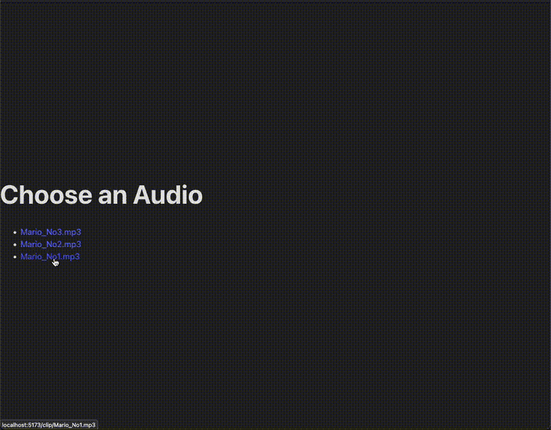

# 🎧 Audio Clip Demo App

A minimal full-stack application for selecting, clipping, and downloading audio tracks with a streamlined user experience.



## ✨ Features

- Browse available audio tracks
- Visualize audio waveforms
- Select specific regions with precise timing
- Zoom in/out for detailed editing
- Create and download custom audio clips
- Simulated payment process

## 📝 Case Study Example

1. User logs in and views the music list
2. User selects a music track for their project
3. User interacts with the waveform visualization:
   - Listens to the track
   - Zooms in/out for precise selection
   - Selects the exact region needed
4. User clicks "Create Clip" and proceeds to payment
5. After simulated payment, the download link activates
6. User downloads the clip to their local machine

## 🚀 Getting Started

### Prerequisites

- Docker and Docker Compose
- Node.js (v14+) and npm

### Installation

1. **Clone the repository**
   ```bash
   git clone <your-repo-url>
   cd audio-cut-region
   ```

2. **Install frontend dependencies**
   ```bash
   cd frontend
   npm install
   ```

3. **Start backend services**
   ```bash
   # From project root
   docker compose up --build
   ```
   The Flask backend will start on `http://localhost:5003`

4. **Start frontend development server**
   ```bash
   # In the frontend directory
   npm run dev
   ```
   The frontend will be available at `http://localhost:5173`

## 🧩 How It Works

1. **Browse & Select** - Choose from available audio tracks
2. **Edit & Preview** - Use the waveform editor to select your desired clip
3. **Purchase** - Go through a simulated payment process
4. **Download** - Get your custom audio clip

## 🛠️ Tech Stack

| Component | Technology |
|-----------|------------|
| Frontend | React + TypeScript + Vite |
| Backend | Flask (Python) |
| Audio Processing | pydub + ffmpeg |
| Waveform Visualization | WaveSurfer.js |
| Containerization | Docker + Docker Compose |

## 📁 Project Structure

```
audio-cut-region/
├── backend/               # Flask server & audio processing
│   ├── app.py             # Main server application
│   ├── Dockerfile         # Backend container configuration
│   ├── requirements.txt   # Python dependencies
│   └── audios/            # Sample audio files
├── frontend/              # React application
│   ├── src/               # Source code
│   │   ├── components/    # React components
│   │   ├── pages/         # Page components
│   │   └── App.tsx        # Main application component
│   ├── public/            # Static assets
│   └── package.json       # Frontend dependencies
├── assets/                # Project assets
│   └── demo.gif           # Application demo
├── docker-compose.yml     # Multi-container configuration
└── README.md              # Project documentation
```

## 💡 Development Notes

- No database is used; audio files are stored in the `audios/` directory
- The application uses temporary file storage for processed clips
- Users manually choose where to save downloaded clips
- The project is designed for demonstration and MVP proof-of-concept purposes

## 🧠 Key Implementation Concepts (Hands on Practice mateiral for me)

- **Docker Multi-Container Setup** - Separate services for frontend and backend
- **WaveSurfer.js Integration** - Advanced audio visualization and region editing
- **Audio Processing Pipeline** - Server-side audio manipulation with pydub/ffmpeg
- **REST API Communication** - Clean interface between frontend and backend
- **React Hooks for State Management** - Modern approach to frontend state
- **File Download Implementation** - Browser-based file handling techniques

